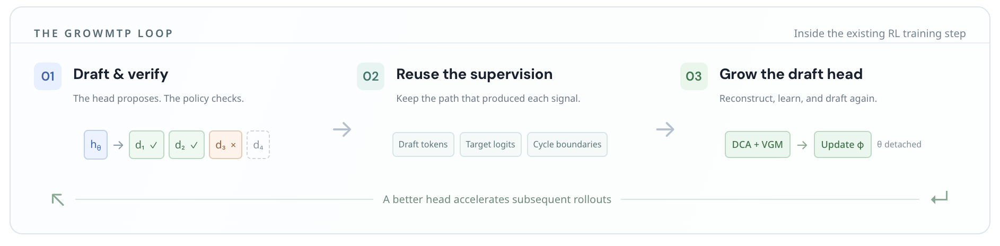
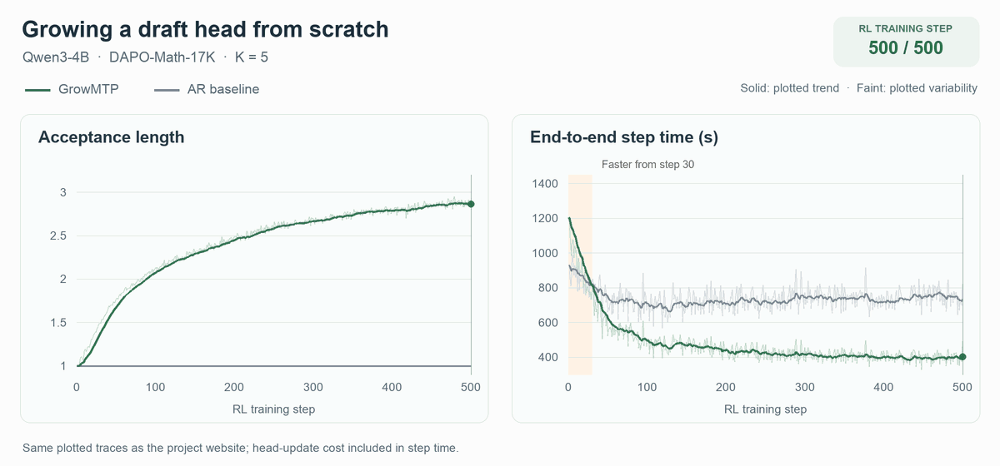

# 🚀 GrowMTP

GrowMTP grows draft heads within reinforcement learning to accelerate the same training run.



## 📌 Description

Autoregressive rollout generation is a major bottleneck in RL post-training. GrowMTP uses verification signals produced during rollouts to train a draft head within the same RL loop, enabling learning from random initialization without offline head training. It reconstructs draft-conditioned states, optimizes a depth-coupled acceptance objective, and masks supervision beyond the first rejection, with head updates detached from the policy backbone. On Qwen3-4B, GrowMTP achieves 2.13× rollout speedup and 1.60× end-to-end training speedup on mathematical reasoning. It also supports online adaptation of pretrained draft heads.



**Growing from scratch on Qwen3-4B.** Acceptance length increases during RL while end-to-end step time falls below the autoregressive baseline.

## ⚙️ Environment

The reference environment uses Linux, Python 3.12, PyTorch 2.11.0 with CUDA 13.0, Transformers 5.3.0, TensorDict 0.10.0, Ray 2.55.1, and `sglang-kernel` 0.4.2.post2. Experiments use 8 H800 GPUs.

Start from an environment with the dependencies in `verl/requirements.txt` and `sglang/python/pyproject.toml` installed, then run:

```bash
bash scripts/install.sh
bash scripts/install.sh --check
```

The installer creates `.venv`, inherits the existing environment’s packages, and installs the two local frameworks without upgrading dependencies. Set `GROWMTP_PYTHON` to select a different base Python environment.

## 📦 Preparation

Download model checkpoints and datasets locally.

| Model preset | Checkpoint | Draft head |
|---|---|---|
| `qwen3_4b` | [Qwen3-4B](https://huggingface.co/Qwen/Qwen3-4B) | Random initialization |
| `mimo_7b` | [MiMo-7B-SFT](https://huggingface.co/XiaomiMiMo/MiMo-7B-SFT) | Pretrained |
| `qwen3_5_4b` | [Qwen3.5-4B-Base](https://huggingface.co/Qwen/Qwen3.5-4B-Base) | Pretrained |

For Qwen3-4B, create the random draft head once before training. The other models load their native heads directly.

```bash
bash scripts/prepare_model.sh \
  --model-path /models/Qwen3-4B \
  --output /models/Qwen3-4B-growmtp
```

| Task | Training data | Inference evaluation data |
|---|---|---|
| Math | [DAPO-Math-17K](https://huggingface.co/datasets/BytedTsinghua-SIA/DAPO-Math-17k) | [AMC23](https://huggingface.co/datasets/AI-MO/aimo-validation-amc) (2023 subset), [AIME24](https://huggingface.co/datasets/HuggingFaceH4/aime_2024), [AIME25](https://huggingface.co/datasets/math-ai/aime25) |
| Code | [TACO-Verified](https://huggingface.co/datasets/likaixin/TACO-verified) | [LiveCodeBench v6](https://huggingface.co/datasets/livecodebench/code_generation_lite), including its AtCoder and LeetCode subsets |

Convert downloaded training parquet files to the training format:

```bash
bash scripts/prepare_data.sh --task math \
  --input /data/dapo-raw.parquet --output /data/math-train.parquet

bash scripts/prepare_data.sh --task code \
  --input /data/taco-raw.parquet --output /data/code-train.parquet
```

Prepare validation files separately using the same conversion. Existing veRL-formatted parquet files can be used directly.

## 🚀 Quick Start

Train Qwen3-4B on Math:

```bash
bash scripts/train.sh \
  --model qwen3_4b \
  --model-path /models/Qwen3-4B-growmtp \
  --train-file /data/math-train.parquet \
  --val-file /data/math-val.parquet \
  --output /outputs/qwen3-math
```

Checkpoints include an inference-ready model at `global_step_N/actor/huggingface`. Run inference from the trained checkpoint:

```bash
bash scripts/infer.sh \
  --model qwen3_4b \
  --model-path /outputs/qwen3-math/global_step_500/actor/huggingface \
  --depth 5 \
  --prompt 'Compute 2+3.'
```

Replace the example paths with your local paths.

## 🔄 Other Models and Tasks

| Model preset | Drafting depth | Training steps |
|---|---|---|
| `qwen3_4b` | 5 | 500 |
| `mimo_7b` | 3, 5, or 7 | 200 |
| `qwen3_5_4b` | 3 | 200 |

Change `--model` and `--model-path` to switch models. Use `--depth` to select drafting depth and the same depth for inference.

Both tasks are supported by every preset. For Code, add `--task code` and supply the corresponding training and validation files.

Use `--gpus`, `--nodes`, and `--steps` to adjust resources and run length. Add `--dry-run` to inspect the training command. Full defaults are in `verl/verl/trainer/config/growmtp/`; additional settings can be passed as Hydra `key=value` arguments.

## 🙏 Acknowledgements

Built on [veRL](https://github.com/verl-project/verl) and [SGLang](https://github.com/sgl-project/sglang). Their licenses and notices are retained in the respective directories.
